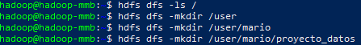
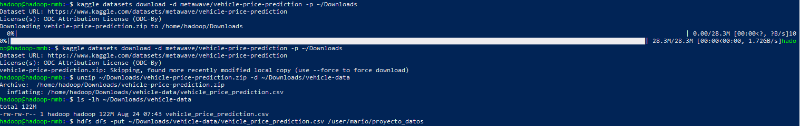
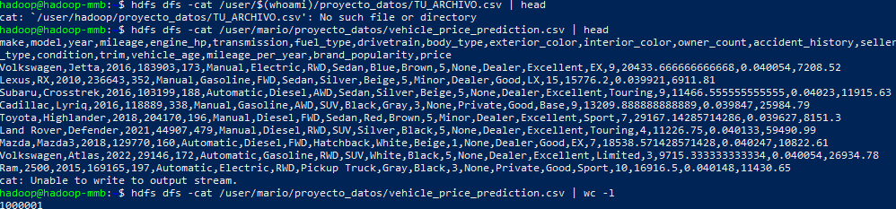
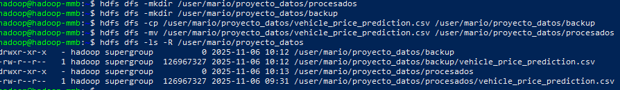
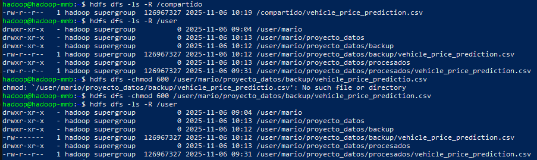

## PR0202: Uso del cliente HDFS

### 1. Preparación del entorno

### 2. Carga del dataset

### 3. Explporación de datos

### 4. Organización del proyecto

### 5. Colaboración en el equipo

### 6. Recuperación de datos

### 7. Control de accesos

