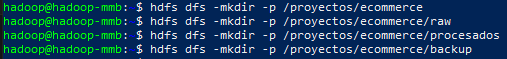
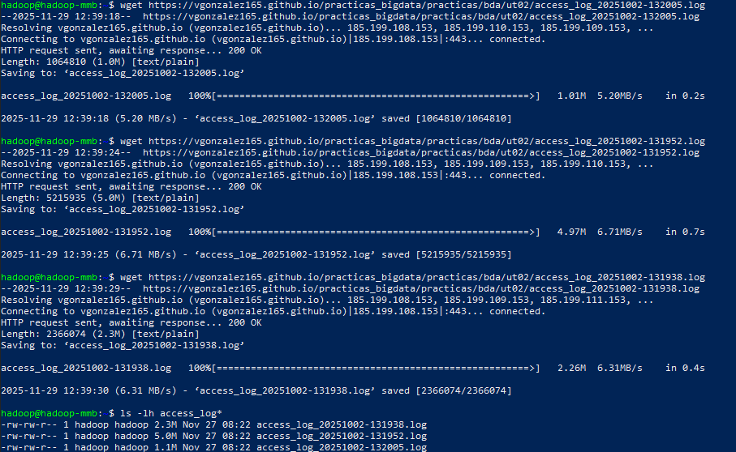
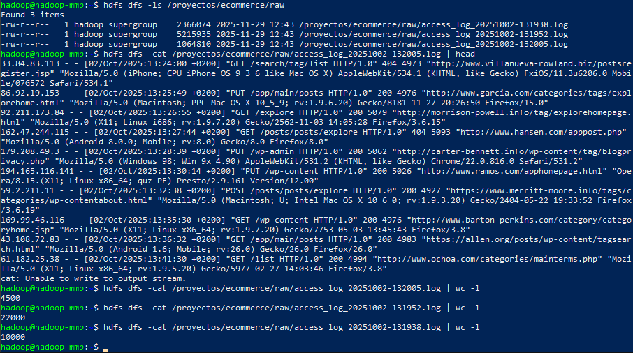
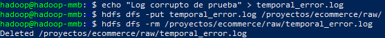

## PR0203: Uso del cliente HDFS (2)

### 1. Preparación del espacio de trabajo en HDFS

### 2. Carga inicial de logs

### 3. Inspección de datos

### 4. Organización dde los logs

### 5. Acceso compartido para analistas

### 6. Simulación de trabajo con analistas

### 7. Mantenimiento y limpieza

