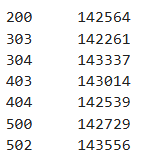
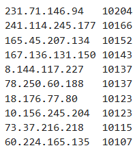
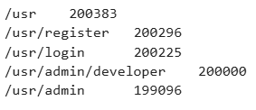
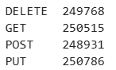
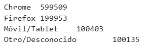
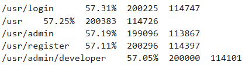

# PR0403: Análisis de logs con MapReduce

## Estadísticas básicas

### Contador de códigos de estado HTTP

mapper1
```
%%writefile mapper1.py

import sys
import re

LOG_PATTERN = re.compile(
    r'(\S+)\s+-\s+-\s+\[(.*?)\]\s+"(\S+)\s+(.*?)\s+(\S+)"\s+(\d+)\s+(\S+)\s+"(.*?)"\s+"(.*?)"'
)

for line in sys.stdin:
    line = line.strip()
    match = LOG_PATTERN.match(line)
    if match:
        status_code = match.group(6) 
        print(f"{status_code}\t1")
```

reducer1
```
%%writefile reducer1.py

import sys

current_key = None
current_count = 0

for line in sys.stdin:
    line = line.strip()
    if not line:
        continue
        
    try:
        key, count_str = line.split('\t', 1)
        count = int(count_str)
    except ValueError:
        continue

    if current_key == key:
        current_count += count
    else:
        if current_key:
            print(f"{current_key}\t{current_count}")
        current_key = key
        current_count = count

if current_key:
    print(f"{current_key}\t{current_count}")
```

Ejecución
```
!cat "logfiles.log" | python3 mapper1.py | sort | python3 reducer1.py
```

Salida




### Tráfico total por IP
mapper
```
%%writefile mapper2.py

import sys
import re

LOG_PATTERN = re.compile(
    r'(\S+)\s+-\s+-\s+\[(.*?)\]\s+"(\S+)\s+(.*?)\s+(\S+)"\s+(\d+)\s+(\S+)\s+"(.*?)"\s+"(.*?)"'
)

for line in sys.stdin:
    line = line.strip()
    match = LOG_PATTERN.match(line)
    if match:
        ip = match.group(1)
        bytes_str = match.group(7)
        
        bytes_sent = bytes_str if bytes_str.isdigit() else '0'
        
        print(f"{ip}\t{bytes_sent}")
```
reducer
```
%%writefile reducer2.py

import sys

current_ip = None
total_bytes = 0

for line in sys.stdin:
    line = line.strip()
    if not line:
        continue
        
    try:
        ip, bytes_str = line.split('\t', 1)
        bytes_sent = int(bytes_str)
    except ValueError:
        continue

    if current_ip == ip:
        total_bytes += bytes_sent
    else:
        if current_ip:
            print(f"{current_ip}\t{total_bytes}")
        current_ip = ip
        total_bytes = bytes_sent

if current_ip:
    print(f"{current_ip}\t{total_bytes}")
```
Ejecución
```
!cat "logfiles.log" | python3 mapper2.py | sort | python3 reducer2.py | sort -rn -k2 | head -10
```
Salida



## Análisis de comportamiento

### RLs más populares

mapper
```
%%writefile mapper3.py

import sys
import re

LOG_PATTERN = re.compile(
    r'(\S+)\s+-\s+-\s+\[(.*?)\]\s+"(\S+)\s+(.*?)\s+(\S+)"\s+(\d+)\s+(\S+)\s+"(.*?)"\s+"(.*?)"'
)

for line in sys.stdin:
    line = line.strip()
    match = LOG_PATTERN.match(line)
    if match:
        url = match.group(4)
        if url: 
            print(f"{url}\t1")
```
reducer
```
%%writefile reducer3.py

import sys

current_url = None
current_count = 0

for line in sys.stdin:
    line = line.strip()
    if not line:
        continue
        
    try:
        url, count_str = line.split('\t', 1)
        count = int(count_str)
    except ValueError:
        continue

    if current_url == url:
        current_count += count
    else:
        if current_url:
            print(f"{current_url}\t{current_count}")
        current_url = url
        current_count = count

if current_url:
    print(f"{current_url}\t{current_count}")
```
Ejecución
```
!cat "logfiles.log" | python3 mapper3.py | sort | python3 reducer3.py | sort -rn -k2 | head -10
```
Salida



### Distribución por Método HTTP
mapper
```
%%writefile mapper4.py

import sys
import re

LOG_PATTERN = re.compile(
    r'(\S+)\s+-\s+-\s+\[(.*?)\]\s+"(\S+)\s+(.*?)\s+(\S+)"\s+(\d+)\s+(\S+)\s+"(.*?)"\s+"(.*?)"'
)

for line in sys.stdin:
    line = line.strip()
    match = LOG_PATTERN.match(line)
    if match:
        method = match.group(3)
        print(f"{method}\t1")
```
reducer
```
%%writefile reducer4.py
import sys

current_method = None
current_count = 0

for line in sys.stdin:
    line = line.strip()
    if not line:
        continue
        
    try:
        method, count_str = line.split('\t', 1)
        count = int(count_str)
    except ValueError:
        continue

    if current_method == method:
        current_count += count
    else:
        if current_method:
            print(f"{current_method}\t{current_count}")
        current_method = method
        current_count = count

if current_method:
    print(f"{current_method}\t{current_count}")
```
Ejecución
```
!cat "logfiles.log" | python3 mapper4.py | sort | python3 reducer4.py
```
Salida



### Análisis de navegadores
mapper
```
%%writefile mapper5.py
import sys
import re

LOG_PATTERN = re.compile(
    r'(\S+)\s+-\s+-\s+\[(.*?)\]\s+"(\S+)\s+(.*?)\s+(\S+)"\s+(\d+)\s+(\S+)\s+"(.*?)"\s+"(.*?)"'
)

for line in sys.stdin:
    line = line.strip()
    match = LOG_PATTERN.match(line)
    if match:
        user_agent = match.group(9).lower()
        
        if 'bot' in user_agent or 'spider' in user_agent or 'crawler' in user_agent:
            browser = "Bot/Crawler"
        elif 'chrome' in user_agent and 'safari' in user_agent and 'edge' not in user_agent:
            browser = "Chrome"
        elif 'firefox' in user_agent:
            browser = "Firefox"
        elif 'mobile' in user_agent or 'android' in user_agent or 'iphone' in user_agent:
            browser = "Móvil/Tablet"
        else:
            browser = "Otro/Desconocido"
            
        print(f"{browser}\t1")
```
reducer
```
%%writefile reducer5.py
import sys

current_browser = None
current_count = 0

for line in sys.stdin:
    line = line.strip()
    if not line:
        continue
        
    try:
        browser, count_str = line.split('\t', 1)
        count = int(count_str)
    except ValueError:
        continue

    if current_browser == browser:
        current_count += count
    else:
        if current_browser:
            print(f"{current_browser}\t{current_count}")
        current_browser = browser
        current_count = count

if current_browser:
    print(f"{current_browser}\t{current_count}")
```
Ejecución
```
!cat "logfiles.log" | python3 mapper5.py | sort | python3 reducer5.py | sort -rn -k2
```
Salida




## Análisis Temporal y de Sesión
### Picos de tráfico por hora
mapper
```
%%writefile mapper6.py
import sys
import re
from datetime import datetime

LOG_PATTERN = re.compile(
    r'(\S+)\s+-\s+-\s+\[(.*?)\]\s+"(\S+)\s+(.*?)\s+(\S+)"\s+(\d+)\s+(\S+)\s+"(.*?)"\s+"(.*?)"'
)
LOG_TIME_FORMAT = '%d/%b/%Y:%H:%M:%S %z'

for line in sys.stdin:
    line = line.strip()
    match = LOG_PATTERN.match(line)
    if match:
        timestamp_raw = match.group(2)
        
        try:
            dt_obj = datetime.strptime(timestamp_raw, LOG_TIME_FORMAT)
            hour = dt_obj.strftime('%H')
            print(f"{hour}\t1")
        except ValueError:
            print("Error_Hora\t1")
```
reducer
```
%%writefile reducer6.py
import sys

current_hour = None
current_count = 0

for line in sys.stdin:
    line = line.strip()
    if not line:
        continue
        
    try:
        hour, count_str = line.split('\t', 1)
        count = int(count_str)
    except ValueError:
        continue

    if current_hour == hour:
        current_count += count
    else:
        if current_hour and current_hour != "Error_Hora":
            print(f"{current_hour}\t{current_count}")
        current_hour = hour
        current_count = count

if current_hour and current_hour != "Error_Hora":
    print(f"{current_hour}\t{current_count}")
```
Ejecución
```
!cat "logfiles.log" | python3 mapper6.py | sort | python3 reducer6.py
```
Salida


### Tasa de error por endpoint
mapper
```
%%writefile mapper7.py
import sys
import re

LOG_PATTERN = re.compile(
    r'(\S+)\s+-\s+-\s+\[(.*?)\]\s+"(\S+)\s+(.*?)\s+(\S+)"\s+(\d+)\s+(\S+)\s+"(.*?)"\s+"(.*?)"'
)

for line in sys.stdin:
    line = line.strip()
    match = LOG_PATTERN.match(line)
    if match:
        url = match.group(4)
        status_code_str = match.group(6)
        
        try:
            status_code = int(status_code_str)
        except ValueError:
            continue
        
        if status_code >= 400:
            print(f"{url}\t0,1")
        else:
            print(f"{url}\t1,0")
```
reducer
```
%%writefile reducer7.py
import sys

current_url = None
total_requests = 0
total_errors = 0

for line in sys.stdin:
    line = line.strip()
    if not line:
        continue
        
    try:
        url, counts_str = line.split('\t', 1)
        success, error = map(int, counts_str.split(','))
    except ValueError:
        continue

    if current_url == url:
        total_requests += success + error
        total_errors += error
    else:
        if current_url:
            if total_requests > 0:
                error_rate = (total_errors / total_requests) * 100
                print(f"{current_url}\t{error_rate:.2f}%\t{total_requests}\t{total_errors}")
            else:
                print(f"{current_url}\t0.00%\t0\t0")
                
        current_url = url
        total_requests = success + error
        total_errors = error

if current_url:
    if total_requests > 0:
        error_rate = (total_errors / total_requests) * 100
        print(f"{current_url}\t{error_rate:.2f}%\t{total_requests}\t{total_errors}")
    else:
        print(f"{current_url}\t0.00%\t0\t0")
```
Ejecución
```
!cat "logfiles.log" | python3 mapper7.py | sort | python3 reducer7.py | sort -rn -k2 | head -10
```
Salida

