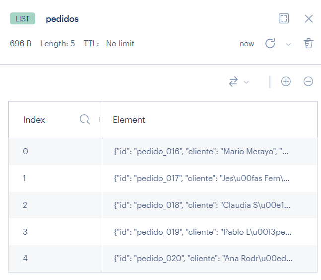
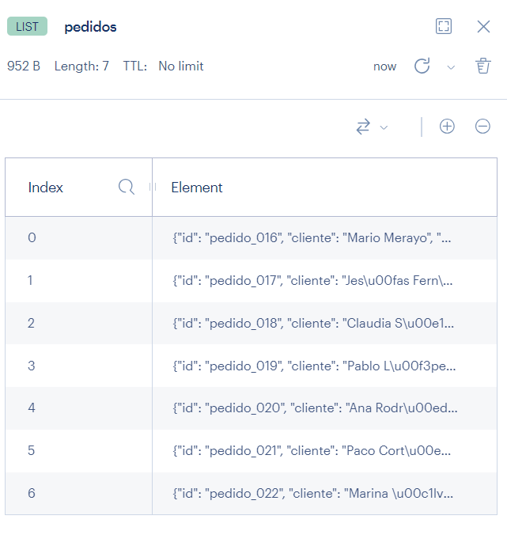
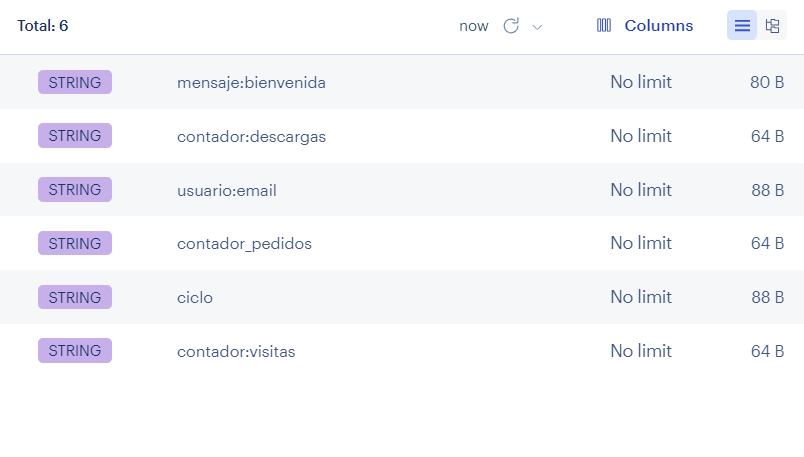

# PR0202: Listas en Redis

Script Python con las funciones requeridas y su uso.
Adjunto capturas de Redis Insigth en cada paso del main.

```

import redis
import json

r = redis.Redis(
    host='redis',
    port=6379,
    db=0,
    decode_responses=True
)

def agregar_pedido(r, cliente, producto, esUrgente):
    nuevo_id = r.incr("contador_pedidos")
    id_pedido = f"pedido_{nuevo_id:03d}"

    pedido= {
        "id": id_pedido,
        "cliente": cliente,
        "producto": producto,
        "cantidad": 1,
        "urgente": esUrgente
    }

    pedido_json = json.dumps(pedido)

    elementos_en_lista = r.rpush("pedidos", pedido_json)

    print("Pedido añadido: ", pedido)

def procesar_pedido(r):
    pedido_eliminado_json = r.lpop("pedidos", count=None)

    pedido_eliminado = json.loads(pedido_eliminado_json)

    print("Pedido eliminado: ", pedido_eliminado)

```

```
if __name__ == "__main__":
    agregar_pedido(r,"Mario Merayo","Teléfono Xiaomi", False)
    agregar_pedido(r,"Jesús Fernández","Aspiradora Bosch", False)
    agregar_pedido(r,"Claudia Sánchez","Impresora Epson", False)
    agregar_pedido(r,"Pablo López","Monitor HP", False)
    agregar_pedido(r,"Ana Rodríguez","Teclado Mars Gaming", False)

    print("Pedidos en lista: ", r.lrange("pedidos", 0, -1))
```



```
agregar_pedido(r,"Paco Cortés","Ratón SteelSeries", False)
agregar_pedido(r,"Marina Álvarez","Auriculares Astro", False)
```



```
procesar_pedido(r)
procesar_pedido(r)
procesar_pedido(r)
procesar_pedido(r)
procesar_pedido(r)
procesar_pedido(r)
procesar_pedido(r)
```
Ya no aparece la lista pedidos, ya que han sido eliminados todos.

