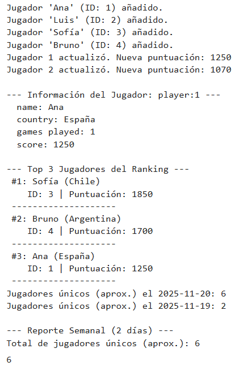

# PR0203: Estructura de datos avnzadas

Script python con las funciones requeridas y su uso.

```
import redis
from datetime import date, timedelta

r = redis.Redis(
    host='redis',
    port=6379,
    db=0,
    decode_responses=True
)
```

### Funciones de gestión de jugadores

```
def add_player(id, name, country, score=0):
    clave_jugador = f"player:{id}"
    
    jugador= {
        "name" : name,
        "country" : country,
        "games played" : 0,
        "score" : score
    }

    r.hset(clave_jugador, mapping=jugador)
    
    r.zadd("leaderboard", {id: score})
    print(f"Jugador '{name}' (ID: {id}) añadido.")

def update_score(id, points):
    clave_jugador = f"player:{id}"

    if not r.exists(clave_jugador):
        print (f"[Error] El jugador con ID {id} no existe.")
        return

    r.hincrby(clave_jugador, "games played", 1)
    
    new_total_score = r.hincrby(clave_jugador, "score", points)
    
    r.zadd("leaderboard", {id: new_total_score})
    print(f"Jugador {id} actualizó. Nueva puntuación: {new_total_score}")

def player_info(id):
    clave_jugador = f"player:{id}"
    
    info = r.hgetall(clave_jugador)
    
    print(f"\n--- Información del Jugador: {clave_jugador} ---")
    for key, value in info.items():
        print(f"  {key}: {value}")
    return info

def show_top_players(n):
    print(f"\n--- Top {n} Jugadores del Ranking ---")

    top_players = r.zrevrange("leaderboard", 0, n - 1, withscores=True)

    for i, (id, score) in enumerate(top_players):
        clave_jugador = f"player:{id}"
    
        res = r.hgetall(clave_jugador)
    
        print(f" #{i+1}: {res['name']} ({res['country']})")
        print (f"    ID: {id} | Puntuación: {int(res['score'])}")
        print(" " + "-"*20)
```

### Funciones de registro de actividad

```
def get_date_key(date_str):
    return f"unique:players:{date_str}"
    
def register_login(player_id, date_str=None):
    if date_str is None:
        date_str = date.today().isoformat()
        
    key = get_date_key(date_str)
    r.pfadd(key, player_id)

def count_unique_logins(date_str):
    key = get_date_key(date_str)
    count = r.pfcount(key)
    print(f"Jugadores únicos (aprox.) el {date_str}: {count}")
    return count

def weekly_report(dates_list):
    keys_to_merge = [get_date_key(d) for d in dates_list]

    report_key = "unique:players:week:report"

    r.pfmerge(report_key, *keys_to_merge)

    total_unique = r.pfcount(report_key)

    print(f"\n--- Reporte Semanal ({len(dates_list)} días) ---")
    print(f"Total de jugadores únicos (aprox.): {total_unique}")

    r.delete(report_key)

    return total_unique
    
```

### Ejecución del código 

```
add_player(id="1", name="Ana", country="España", score=1200)
add_player(id="2", name="Luis", country="México", score=950)
add_player(id="3", name="Sofía", country="Chile", score=1850)
add_player(id="4", name="Bruno", country="Argentina", score=1700)

update_score(id="1", points=50)
update_score(id="2", points=120)

player_info(id="1")

show_top_players(3)

today = date.today().isoformat()

register_login("1", today)
register_login("2", today)
register_login("1", today)

yesterday = (date.today() - timedelta(days=1)).isoformat()

register_login("2", yesterday)
register_login("3", yesterday)

count_unique_logins(today)
count_unique_logins(yesterday)

weekly_report([today, yesterday])
```

### Salida del código 

