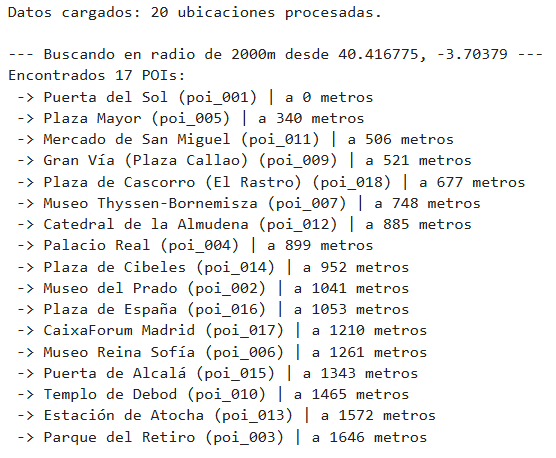

# PR0204: Estructura de datos avnzadas: datos geoespaciales

### Archivo locations.py

```
POIS = [
    {"id": "poi_001", "name": "Puerta del Sol", "lon": -3.703790, "lat": 40.416775},
    {"id": "poi_002", "name": "Museo del Prado", "lon": -3.692140, "lat": 40.413780},
    {"id": "poi_003", "name": "Parque del Retiro", "lon": -3.684440, "lat": 40.415360},
    {"id": "poi_004", "name": "Palacio Real", "lon": -3.714310, "lat": 40.417910},
    {"id": "poi_005", "name": "Plaza Mayor", "lon": -3.707370, "lat": 40.415380},
    {"id": "poi_006", "name": "Museo Reina Sofía", "lon": -3.694340, "lat": 40.408010},
    {"id": "poi_007", "name": "Museo Thyssen-Bornemisza", "lon": -3.695000, "lat": 40.416100},
    {"id": "poi_008", "name": "Estadio Santiago Bernabéu", "lon": -3.692380, "lat": 40.453050},
    {"id": "poi_009", "name": "Gran Vía (Plaza Callao)", "lon": -3.708000, "lat": 40.420200},
    {"id": "poi_010", "name": "Templo de Debod", "lon": -3.718000, "lat": 40.424300},
    {"id": "poi_011", "name": "Mercado de San Miguel", "lon": -3.709300, "lat": 40.415000},
    {"id": "poi_012", "name": "Catedral de la Almudena", "lon": -3.714200, "lat": 40.416000},
    {"id": "poi_013", "name": "Estación de Atocha", "lon": -3.690500, "lat": 40.406900},
    {"id": "poi_014", "name": "Plaza de Cibeles", "lon": -3.693000, "lat": 40.419200},
    {"id": "poi_015", "name": "Puerta de Alcalá", "lon": -3.688700, "lat": 40.420500},
    {"id": "poi_016", "name": "Plaza de España", "lon": -3.712000, "lat": 40.423900},
    {"id": "poi_017", "name": "CaixaForum Madrid", "lon": -3.693400, "lat": 40.409300},
    {"id": "poi_018", "name": "Plaza de Cascorro (El Rastro)", "lon": -3.706700, "lat": 40.411100},
    {"id": "poi_019", "name": "Matadero Madrid", "lon": -3.703200, "lat": 40.391600},
    {"id": "poi_020", "name": "Estadio Cívitas Metropolitano", "lon": -3.599100, "lat": 40.436300},
]
```

### Archivo load_locations.py

```
from locations import POIS

def load_data(redis_client):
    redis_client.delete("poi:locations", "poi:info")

    for poi in POIS:
        redis_client.geoadd("poi:locations", (poi["lon"], poi["lat"], poi["id"]))

        redis_client.hset("poi:info", poi["id"], poi["name"])
    print(f"Datos cargados: {len(POIS)} ubicaciones procesadas.")
    
```

### Archivo find_by_radius.py

```
def find_at_location(redis_client, lat, lon, distance=2000):
    print(f"\n--- Buscando en radio de {distance}m desde {lat}, {lon} ---")
    
    resultados = redis_client.geosearch(
        name="poi:locations",
        longitude=lon,
        latitude=lat,
        radius=distance,
        unit="m",
        withdist=True,
        sort="ASC"
    )
    
    if not resultados:
        print("No se encontraron lugares cercanos.")
        return

    print(f"Encontrados {len(resultados)} POIs:")
    for poi_id, dist in resultados:
        nombre = redis_client.hget("poi:info", poi_id)
        print(f" -> {nombre} ({poi_id}) | a {int(dist)} metros")
```

### Código ejecutado desde el notebook

```
import redis

r = redis.Redis(
    host='redis',
    port=6379,
    db=0,
    decode_responses=True
)

from load_locations import load_data
from find_by_radius import find_at_location

load_data(r)

find_at_location(r, 40.416775, -3.703790, distance=2000)
```

### Salida del código del notebook

