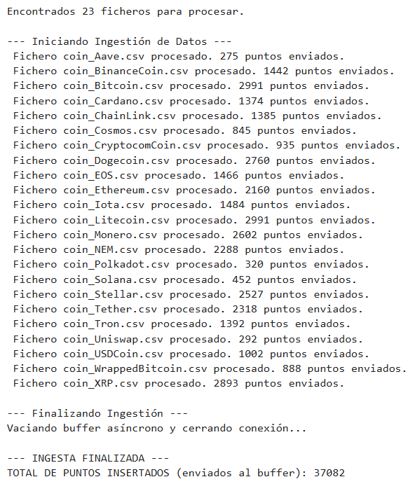

## Ingesta de datos financieros en InfluxDB

```
import os
import csv
from influxdb_client import InfluxDBClient, Point
from influxdb_client.client.write_api import SYNCHRONOUS, ASYNCHRONOUS

INFLUX_URL = "http://localhost:8086"
INFLUX_TOKEN = "pY8NneFC5iDvPM2LKuL1v-e1NR7was3ddvW5g6jniZ30voUqkoRvEIg74VBwioQowBIGHh-4FjPy60lW24e1vQ=="
INFLUX_ORG = "docs"
BUCKET_NAME = "crypto_raw"

DATA_DIR = "data/crypto_files/"
MEASUREMENT_NAME = "daily_quote"
BATCH_SIZE = 5000

COLUMNS = ['Symbol', 'Name', 'Date', 'Close', 'High', 'Low', 'Open', 'Volume', 'Marketcap']

print("Configuración lista.")
print(f"Directorio de datos: {DATA_DIR}")
print(f"Bucket de destino: {BUCKET_NAME}")
print(f"Modo de escritura: ASYNCHRONOUS (Batch size: {BATCH_SIZE})")
```

### Script ingesta_crypto

```
%%writefile ingesta_crypto.py

import os
import csv
from influxdb_client import InfluxDBClient, Point
from influxdb_client.client.write_api import ASYNCHRONOUS

INFLUX_URL = "http://localhost:8086"
INFLUX_TOKEN = "pY8NneFC5iDvPM2LKuL1v-e1NR7was3ddvW5g6jniZ30voUqkoRvEIg74VBwioQowBIGHh-4FjPy60lW24e1vQ=="
INFLUX_ORG = "docs"
BUCKET_NAME = "crypto_raw"

DATA_DIR = "data/crypto_files/"
MEASUREMENT_NAME = "daily_quote"
BATCH_SIZE = 5000

def ingestar_datos_crypto():
    
    try:
        if not os.path.isdir(DATA_DIR):
            print(f"Error: El directorio {DATA_DIR} no se encuentra.")
            print("Por favor, asegúrate de que la carpeta 'crypto_files' esté en la misma ubicación que este script/notebook.")
            return

        csv_files = [f for f in os.listdir(DATA_DIR) if f.endswith('.csv')]
        if not csv_files:
            print(f"Advertencia: No se encontraron ficheros CSV en {DATA_DIR}")
            return
        
        print(f"Encontrados {len(csv_files)} ficheros para procesar.")
    except Exception as e:
        print(f"Error al listar archivos: {e}")
        return

    client = InfluxDBClient(url=INFLUX_URL, token=INFLUX_TOKEN, org=INFLUX_ORG)
    
    def success_callback(conf, data):
        """Callback al finalizar un batch con éxito."""
        pass 

    def error_callback(conf, data, exception):
        """Callback para manejar errores de escritura."""
        print(f"\n--- ERROR DE ESCRITURA ---")
        print(f"Excepción: {exception}")
        print(f"--------------------------\n")

    write_api = client.write_api(
        write_options=ASYNCHRONOUS,
        success_callback=success_callback,
        error_callback=error_callback
    )
    
    puntos_totales = 0

    print("\n--- Iniciando Ingestión de Datos ---")
    
    for filename in csv_files:
        filepath = os.path.join(DATA_DIR, filename)
        puntos_fichero = 0
        
        try:
            with open(filepath, mode='r', encoding='utf-8') as csvfile:
                reader = csv.reader(csvfile)
                
                next(reader) 
                
                for row in reader:
                    
                    if len(row) < 10:
                        continue
                        
                    name = row[1]
                    symbol = row[2]
                    date_str = row[3]
                    
                    try:
                        high = float(row[4])
                        low = float(row[5])
                        open_ = float(row[6])
                        close = float(row[7])
                        volume = float(row[8])
                        marketcap = float(row[9])
                    except ValueError:
                        continue
                    
                    point = (
                        Point(MEASUREMENT_NAME)
                        .tag("symbol", symbol)
                        .tag("name", name)
                        .time(date_str) 
                        .field("close", close)
                        .field("high", high)
                        .field("low", low)
                        .field("open", open_)
                        .field("volume", volume)
                        .field("marketcap", marketcap)
                    )
                    
                    write_api.write(bucket=BUCKET_NAME, record=point)
                    
                    puntos_totales += 1
                    puntos_fichero += 1
                    
                    if puntos_fichero % 5000 == 0:
                         print(f"   -> {puntos_fichero} puntos procesados en {filename}", end='\r')

            print(f" Fichero {filename} procesado. {puntos_fichero} puntos enviados.")

        except Exception as e:
            print(f" Error al procesar el fichero {filename}: {e}")
            
    print("\n--- Finalizando Ingestión ---")
    print("Vaciando buffer asíncrono y cerrando conexión...")
    
    write_api.close()
    client.close() 

    print(f"\n--- INGESTA FINALIZADA ---")
    print(f"TOTAL DE PUNTOS INSERTADOS (enviados al buffer): {puntos_totales}")


if __name__ == "__main__":
    ingestar_datos_crypto()
```

### Salida

